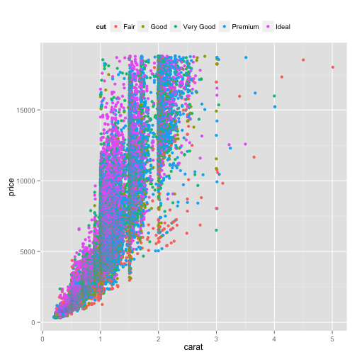

## Data Summary

```r
library(ggplot2)
data(diamonds)
str(diamonds)
```

```
## 'data.frame':	53940 obs. of  10 variables:
##  $ carat  : num  0.23 0.21 0.23 0.29 0.31 0.24 0.24 0.26 0.22 0.23 ...
##  $ cut    : Ord.factor w/ 5 levels "Fair"<"Good"<..: 5 4 2 4 2 3 3 3 1 3 ...
##  $ color  : Ord.factor w/ 7 levels "D"<"E"<"F"<"G"<..: 2 2 2 6 7 7 6 5 2 5 ...
##  $ clarity: Ord.factor w/ 8 levels "I1"<"SI2"<"SI1"<..: 2 3 5 4 2 6 7 3 4 5 ...
##  $ depth  : num  61.5 59.8 56.9 62.4 63.3 62.8 62.3 61.9 65.1 59.4 ...
##  $ table  : num  55 61 65 58 58 57 57 55 61 61 ...
##  $ price  : int  326 326 327 334 335 336 336 337 337 338 ...
##  $ x      : num  3.95 3.89 4.05 4.2 4.34 3.94 3.95 4.07 3.87 4 ...
##  $ y      : num  3.98 3.84 4.07 4.23 4.35 3.96 3.98 4.11 3.78 4.05 ...
##  $ z      : num  2.43 2.31 2.31 2.63 2.75 2.48 2.47 2.53 2.49 2.39 ...
```
---

---
## Exploratory Data Analysis
As an example, we plot `price` as function of `carat` and `cut`. 
 
---

---
## RandomForest
* To expedite the prediction, 1000 samples are subsetted randomly from original about 50000 observations.

```r
library(caret)
library(randomForest)
diamonds <- diamonds[sample(nrow(diamonds), 1000, replace=FALSE), ]
modFit <- randomForest(price~., data=diamonds)
```
* User's input is recorded and formed into a one-row data frame `urDiamond`. 
* The price of diamond described by this data frame can be predicted with `predict()`.

```r
price <- predict(modFit, urDiamond)
```
---

---
## Acknowledges
* This app is built with `shiny` package. The `server.R`, `ui.R` and supporting files are
  in this [repo](https://github.com/arendale/DataProduct).
* This app is published on [shinyapp](http://arendale.shinyapps.io/DataProduct/).
